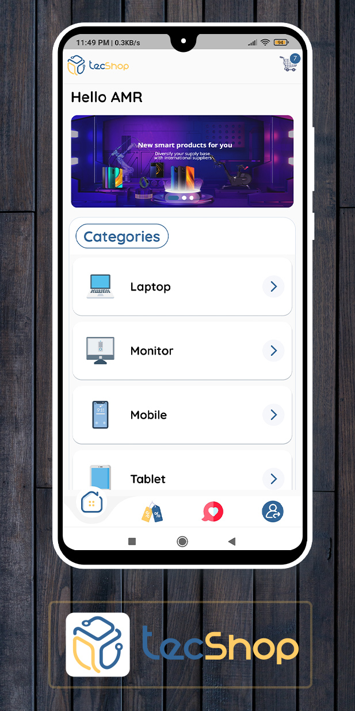
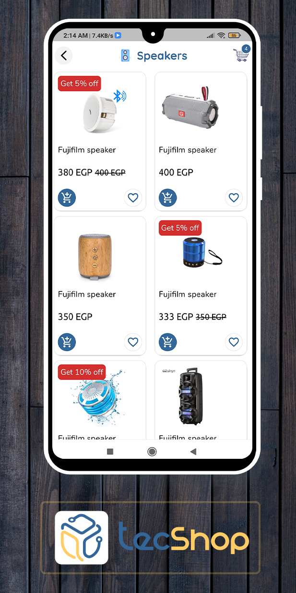
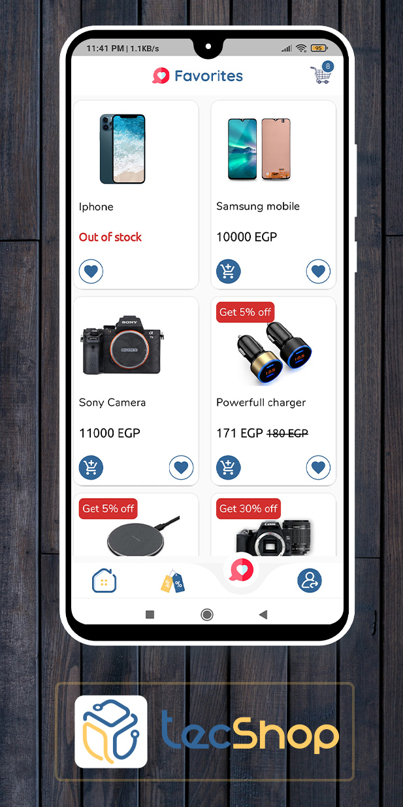
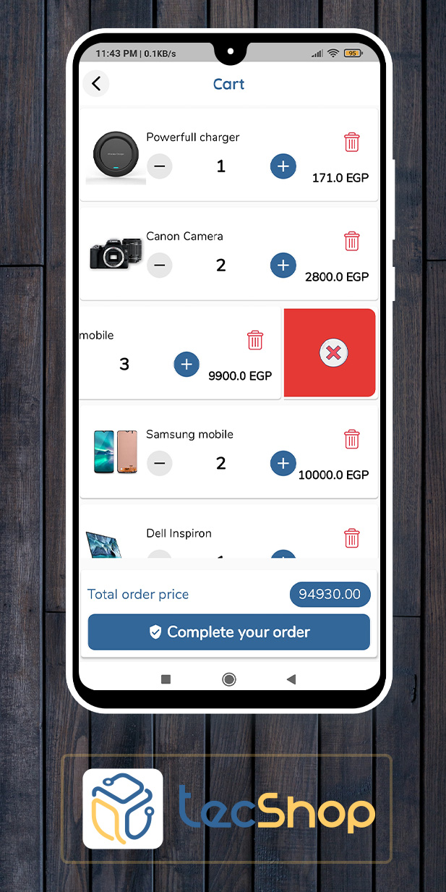
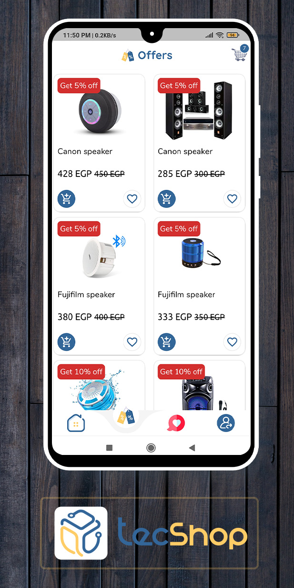
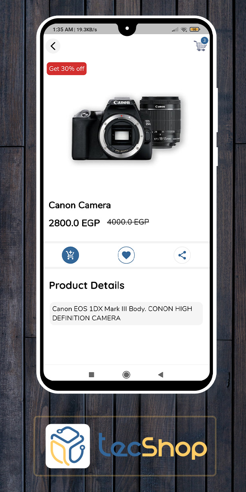
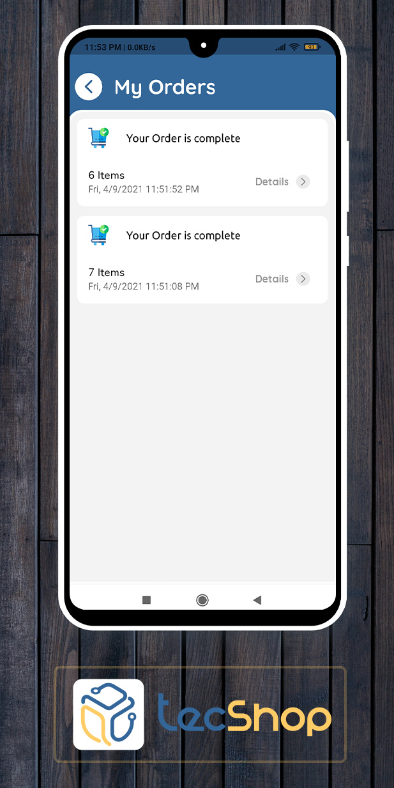
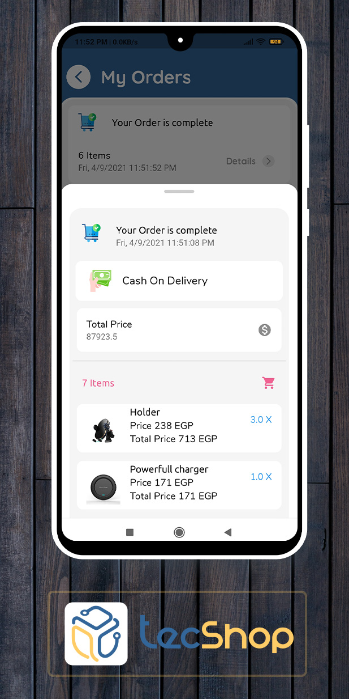
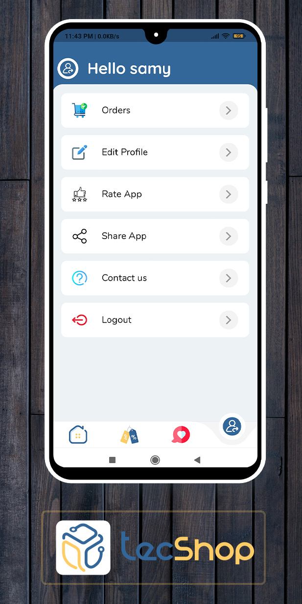
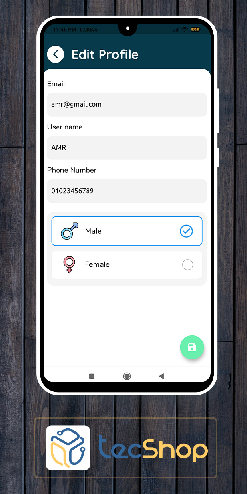

# TecShop : Electronics Shoping

## TecShop is a *small open source* version of Mercado app (E-commerce application)

 

<table style="width:100%" >
  
  <tr> 
   <th>   <h2>Authentication Screen</h2>   </th> 
  <tr/>
  <tr>
    <th></th>
  </tr>
  

  <tr>  
   <th>   <h2>Home Screen</h2> </th>
  <tr/>
  <tr>
   <th></th>
  </tr>
  
  
  <tr>  
   <th>   <h2>Category Screen</h2> </th>
  <tr/>
  <tr>
   <th></th>
  </tr>
  
  
  <tr>  
   <th>   <h2>Favorite Screen</h2> </th>
  <tr/>
  <tr>
   <th></th>
  </tr>
  
  
  <tr>  
   <th>   <h2>Cart Screen</h2> </th>
  <tr/>
  <tr>
   <th></th>
  </tr>
  
   
   
  <tr>  
   <th>   <h2>Offer Screen</h2> </th>
  <tr/>
  <tr>
   <th></th>
  </tr>

  <tr>  
   <th>   <h2>ProductDetails Screen</h2> </th>
  <tr/>
  <tr>
   <th></th>
  </tr>
  
      
 
  <tr>  
   <th>   <h2>Orders Screen</h2> </th>
  <tr/>
  <tr>
   <th></th>
  </tr>
  
   
  <tr>  
   <th>   <h2>OrderDetails Screen</h2> </th>
  <tr/>
  <tr>
   <th></th>
  </tr>
  
  <tr>  
   <th>   <h2>Profile Screen</h2> </th>
  <tr/>
  <tr>
   <th></th>
  </tr>
    
  <tr>  
   <th>   <h2>EditProfile Screen</h2> </th>
  <tr/>
  <tr>
   <th></th>
  </tr>  
  
  
</table>

# Directory Structure
## (Files with X mark are not exist )>> contact me for complete access.

<pre>
<code>
lib
|
│───config
|    └──route.dart
|    |──changeNotifierProviders.dart
|    |──enums.dart
|    └──apiConstants.dart
|
│───floating
|    └──bottomNavigationBarContent.dart
|
│───globalWidgets
|    │──appBars.dart
|    │──backBtnPop.dart
|    │──cartBadge.dart
|    │──circleIcon.dart
|    |──EmptyMessage.dart
|    |──goToLabelArrow.dart
|    |──headerWithLead.dart
|    |──headerWithTail.dart
|    |──iconLabelButton.dart
|    |──offerBatch.dart
|    └──txtField.dart
|
│───mainScreens
|    │──authScreen.dart
|    |──cartScreen.dart
|    |──contactUsScreen.dart
|    |──editProfileScreen.dart
|    |──favoriteScreen.dart
|    |──homeScreenContent.dart
|    |──homeScreenRoot.dart
|    |──offerProductScreen.dart
|    |──orderScreen.dart
|    |──productDetailsScreen.dart
|    |──productScreen.dart
|    |──profile|Screen.dart
|    |──showImageScreen.dart
|    └──splashScreen.dart
|
│───models
|    │──cartApiModel.dart
|    |──categoryModel.dart
|    |──checkItemModel.dart
|    |──httpException.dart
|    |──offerModel.dart
|    |──orderModel.dart -----------------X 
|    |──productModel.dart
|    |──userAuthDataModel.dart
|    └──userModel.dart ------------------X
|
│───providers
|    │──authProvider.dart ---------------X
|    |──cartProvider.dart ---------------X
|    |──categoryProvider.dart
|    |──favoriteProvider.dart
|    |──genderProvider.dart
|    |──homeScreenProvider.dart ---------X
|    |──offerProvider.dart
|    |──orderProvider.dart
|    |──productProvider.dart
|    └──userProvider.dart
|
│───ScreenWidgets
|   |
|   |───authScreen ----------------------X
|   |   |──authForm.dart
|   |   └──components.dart
|   |      |
|   |      |──emailField.dart
|   |      |──logoCard.dart
|   |      |──passwordField.dart
|   |      └──roundButton.dart
|   |
|   |───cartScreen
|   |   |──cartItem.dart
|   |   └──completeOrderBtn.dart
|   |   └──dismissibleBg.dart
|   |
|   |
|   |───contactUsScreen
|   |   |──contactIconRow.dart
|   |   └──contactIcon.dart
|   |   └──mercadoBtn.dart
|   |
|   |───editProfileScreen
|   |   |──checkItemWidget.dart
|   |   └──chooseGenderType.dart
|   |
|   |
|   |───favoriteScreen
|   |   └──favoriteProductGrid.dart
|   |
|   |───homeScreen
|   |   |──categoryElement.dart
|   |   └──categoryList.dart
|   |   └──titleHeader.dart
|   |   └──titleHeaderSimple.dart
|   |
|   |
|   |───offerScreen
|   |   └──offerGridProducts.dart
|   |   └──carouselComponents.dart
|   |      └─carouselDemo.dart
|   |      └──slideElement.dart
|   |
|   |
|   |
|   |───orderScreen ---------------------X
|   |   |──orderDetailsBsheet.dart
|   |   └──orderItem.dart
|   |   └──orderProductDetails.dart
|   |   └──orderProductList.dart
|   |
|   |
|   |
|   |───product
|   |   |──bottomButton.dart
|   |   └──cartButton.dart
|   |   └──favoriteButton.dart
|   |   └──productGridItem.dart
|   |   └──productItem.dart
|   |   └──productPrice.dart
|   |   └──shareButton.dart
|   |
|   |
|   |───productDetailsScreen
|   |   |──brandNameAndPrice.dart
|   |   └──errorContainer.dart
|   |   └──productDetails.dart
|   |
|   |
|   |───profileScreen
|   |   |──gotoBtnCard.dart
|   |   └──profileScreenItems.dart
|   |
|   |
|   └───themes
|       |──lightColor.dart
|       |──theme.dart
|       └──productDetails.dart
| 
|
│───main.dart
└───generalFunctions.dart

</code>
</pre>

# Features : 

    
- Powerfull user experience and user interface.
- Responsive app for mobiles and small tablets.
- Complete authentication system.
- Complete admin panel for:
    - Adding multiple categories.
    - CRUD operation for Categories.
    - CRUD operation for Products.
    - Product can belong to multiple categories.

- Favorite basket.
- Shopping cart.
- Profile editing .
- ordering system .
- State management with Provider.
- Complete back end system using Node.js with express.
- Mongo db for database.
- Clean Code and Structure.
     

# TecShop is a Small Version of Mercado App

 

 

# Youtube Mercado video

 

# Follow Me 
<table>
  <tr>
  <th>
    
    </th>
   
   
   <th>
    
    </th>
    
   <th>
    
   </th>
  </tr>
</table>
